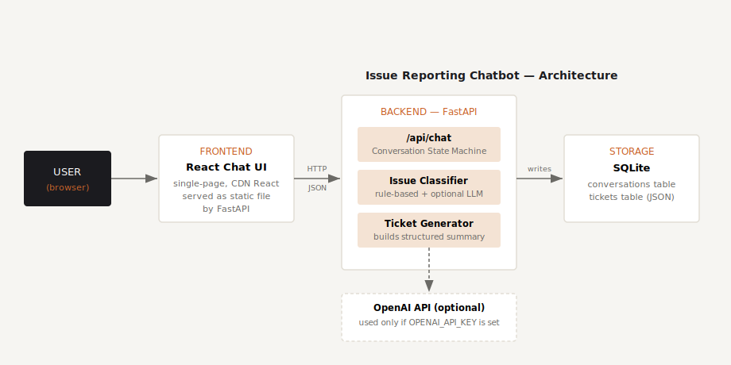

# Issue Desk — Issue Reporting Chatbot

A chatbot prototype that helps users report issues they encounter in an application. It collects the issue description, page/module, error message, time of occurrence, and (optional) user contact details through a guided conversation, classifies the issue into a category using **Groq's Llama 3.3 70B**, generates a structured support ticket, and stores everything in a database.



---

## Tech Stack

| Layer          | Technology                                                          |
| -------------- | --------------------------------------------------------------------- |
| Frontend       | React 18 (via CDN, no build step) + plain CSS                        |
| Backend        | Python 3.10+, FastAPI                                                |
| Database       | SQLite (file-based, zero setup)                                      |
| AI Integration | Groq API — Llama 3.3 70B for issue classification & detail extraction |
| Server         | Uvicorn (ASGI)                                                        |

> The frontend uses React via CDN script tags instead of a Next.js build pipeline so the whole project can be cloned and run with no `npm install` step. See `docs/ASSUMPTIONS_AND_FUTURE.md` for the reasoning and how to upgrade to a full Next.js build later.

---

## Project Structure

```
issue-reporter-chatbot/
├── backend/
│   ├── main.py            # FastAPI app, conversation engine, Groq classifier, DB
│   ├── requirements.txt
│   ├── .env.example       # template for your Groq API key
│   └── chatbot.sqlite3    # created automatically on first run
├── frontend/
│   └── index.html         # single-file React chat UI
├── docs/
│   ├── ARCHITECTURE.md
│   ├── architecture-diagram.svg
│   ├── ASSUMPTIONS_AND_FUTURE.md
│   └── DEPLOYMENT.md
├── render.yaml             # one-click Render Blueprint config
└── README.md
```

---

## Setup Instructions

### Prerequisites

- Python 3.10+
- pip
- A free **Groq API key** → [console.groq.com/keys](https://console.groq.com/keys)

### 1. Clone the repo

```bash
git clone https://github.com/voxility2010/Issue-Reported-Chatbot.git
cd Issue-Reported-Chatbot
```

### 2. Install backend dependencies

```bash
cd backend
pip install -r requirements.txt
```

### 3. Set your Groq API key (required)

This app uses Groq's **Llama 3.3 70B** model to classify issues and extract details from natural conversation — it is **required**, not optional.

```bash
cp .env.example .env
```

Open `backend/.env` and add your real key:

```
GROQ_API_KEY=gsk_your-real-key-here
```

The app loads this file automatically on startup — no terminal export needed.

### 4. Run the server

```bash
uvicorn main:app --reload --port 8000
```

### 5. Open the app

Visit **http://127.0.0.1:8000** in your browser. The chat UI is served directly by the backend, so there's nothing else to start.

### 6. View stored tickets / conversations (for grading/demo)

```bash
# All tickets
curl http://127.0.0.1:8000/api/tickets

# A specific ticket
curl http://127.0.0.1:8000/api/tickets/TCK-XXXXXXXX

# Full transcript of a session
curl http://127.0.0.1:8000/api/conversations/<session_id>
```

Or inspect `backend/chatbot.sqlite3` directly with any SQLite browser (e.g. [DB Browser for SQLite](https://sqlitebrowser.org/)).

---

## How It Works (Quick Tour)

1. Open the page — the bot greets you and asks you to describe the issue.
2. As soon as you describe it, the bot uses Groq (Llama 3.3 70B) to classify the issue (Login Issue, Payment Issue, Technical Bug, Feature Request, Performance Issue, UI/UX Issue, or Other) and asks where it happened.
3. It then asks for any error message, when it happened, and optional contact details — you can type `skip` or `no` to leave any of these blank.
4. It shows you a full structured summary and asks for confirmation.
5. On confirmation, a ticket is created (e.g. `TCK-93CC5F49`) and persisted to SQLite, along with the full conversation transcript.

See `docs/ARCHITECTURE.md` for the full flow diagram and data model, and `docs/ASSUMPTIONS_AND_FUTURE.md` for assumptions and what would be built next with more time.

---

## Deployment

This is a **dynamic web service** (FastAPI backend + Groq API calls + SQLite writes) — not a static site. Deploy it on Render as a **Web Service** using the included `render.yaml` Blueprint.

See `docs/DEPLOYMENT.md` for full step-by-step instructions. Quick version:

1. Push this repo to GitHub (with `render.yaml` at the root).
2. On Render: **New → Blueprint** → select this repo.
3. When prompted, paste your `GROQ_API_KEY` (kept secret, not committed to the repo).
4. Click **Apply** — Render installs dependencies and starts the Uvicorn server automatically.
5. Visit the generated `https://<your-app>.onrender.com` URL.

> Free-tier Render services sleep after 15 minutes of inactivity — the first request after sleep may take 30–50 seconds to wake up. This is expected.

---

## Tests Performed

The conversation flow was exercised end-to-end via the API (see `docs/ARCHITECTURE.md`), confirming:

- Correct category classification via Groq (Llama 3.3 70B)
- All follow-up questions firing in the correct order
- `skip` / `no` handling for optional fields
- Ticket creation and ID generation
- Correct persistence of tickets and transcripts to SQLite
