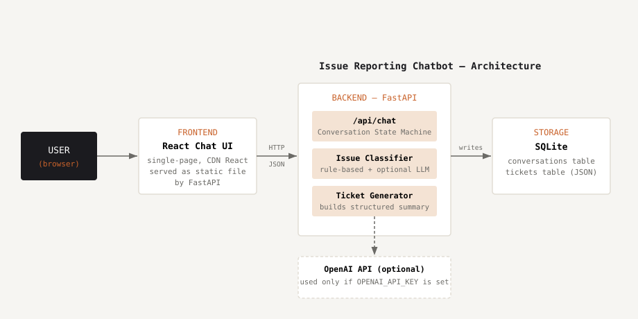

from pathlib import Path

readme = r'''<div align="center">

# 🤖 Issue Reporting Chatbot

### Guided AI-Powered Issue Reporting & Support Ticket Generation

*A chatbot prototype that helps users report issues they encounter in an application through a guided conversation, classifies the issue using Groq's Llama 3.3 70B, generates a structured support ticket, and stores everything in a database.*


</div>

---

## 📊 At a Glance

| | |
|---|---|
| 🤖 **AI model** | Groq — Llama 3.3 70B |
| 💬 **Interaction** | Guided conversational issue reporting |
| 🖥️ **Frontend** | React 18 via CDN + plain CSS |
| ⚙️ **Backend** | Python 3.10+ + FastAPI |
| 🗄️ **Database** | SQLite |
| 🚀 **Server** | Uvicorn (ASGI) |
| 🎫 **Output** | Structured support ticket + conversation transcript |
| 🔑 **API requirement** | Groq API key |

---

## 🏗️ 1. Architecture



```text
User
 │
 ▼
React 18 Chat UI
 │
 ▼
FastAPI Backend
 │
 ▼
Conversation Engine
 │
 ├── Issue description
 │
 ├── Groq classification
 │      └── Llama 3.3 70B
 │
 ├── Page / module
 │
 ├── Error message
 │
 ├── Time of occurrence
 │
 └── Optional contact details
 │
 ▼
Structured Issue Summary
 │
 ▼
User Confirmation
 │
 ▼
Ticket Generation
 │
 ├── Ticket ID
 ├── Issue category
 ├── Issue details
 └── Conversation transcript
 │
 ▼
SQLite Database
